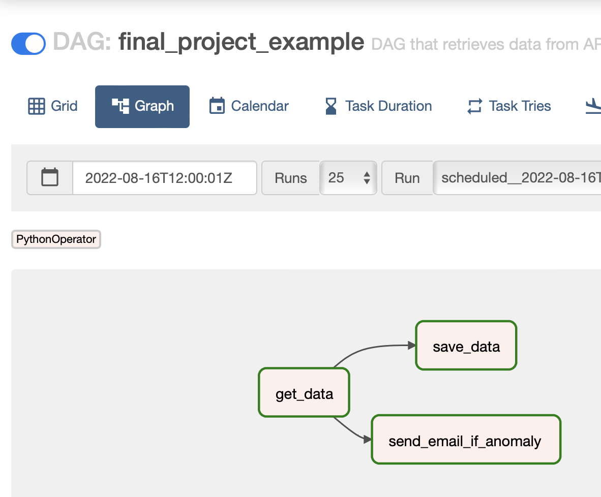

# Coderhouse's Data Engineering Example Final Project
### Developed by Axel Furlan

## Requirements
- Have Docker
- If you want email alerts to work, create a [SendGrid](https://sendgrid.com) account. Don't worry, it's free!

## Description
This code gives you all the tools to run the specific DAG called `get_stocks_data_and_alert`.

What this DAG does is:

1. Pulls data from the [Yahoo Finance Python SDK](https://pypi.org/project/yfinance/)
2. Saves that data into a Postgres Database (simulating a Data Warehouse).
3. Checks against a config file (`config.json`) if the values of the stocks surpass the limits. If they do, it sends an email to whatever address you have configured alerting about the anomaly.

## Configuring your credentials
On the `credentials.env` file, input your `SENDGRID_API_KEY` that you got from your SendGrid account. To get one, go [here](https://app.sendgrid.com/settings/api_keys).

Set `EMAIL_FROM` to the email your configured to send the emails on SendGrid. Set `EMAIL_TO` to whatever address you want the emails to go (I suggest the same as `EMAIL_FROM` to avoid getting flagged).

Remember: emails may go to **SPAM**. Check that folder.

## Usage
It's easy, just do:

1. `make build`
2. `make run`
3. `make get-admin-password` to get the password.
4. Enter `localhost:8080` in whatever browser you want.
5. Input `admin` as the user and the password you got on step 3. Without the `%` char.
6. Once inside, activate the DAG, wait for it to turn dark green and voila! The pipeline ran.
7. To kill everything, you can `make stop`

## HELP!
Run `make help`.
